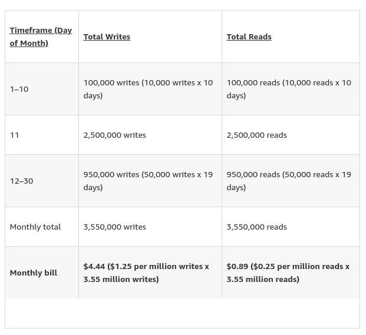
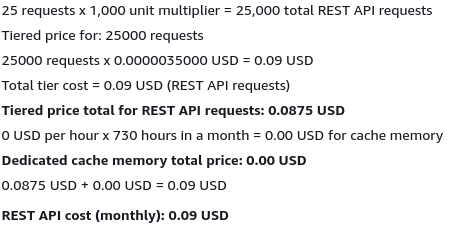
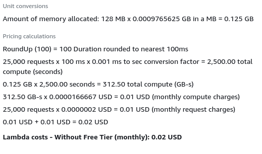
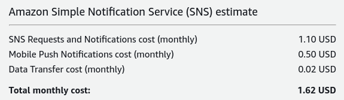
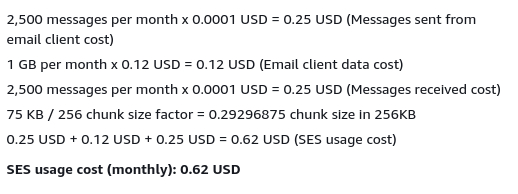

<h1>Pricing</h1>

<h1>Table of Contents</h1>

# AWS DynamoDB

# AWS Gateway API

Amazon Gateway API is very cheap. Both were calculated with two-thousand REST and HTTP API hits a month.

# AWS Lambda
Configured with 5000 monthly HTTP requests and 1GB alloted memory.

# AWS SNS
For mobile notifications

All calculations were done with 1 million requests per month because the calculator doesn't have anything lower.

# AWS SES
For email notifications at 2500 sends and receives and 75KB per email:

